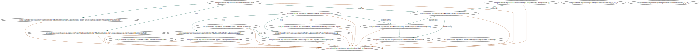

# Coding Challenge: AI Immigration Chatbot with Golang and Temporal

## Disclaimer

Features were implemented according to the requirements, but there are some points that could be improved.

- Authorization/Authentication

## Introduction

This simple api is a chatbot that can answer basic questions, such as visa types, application processes, and common FAQs.

It was built using Golang and [Temporal](https://temporal.io/).

The folders are organized as follows:

- `infra`: contains the IaC to deploy the application using [Pulumi](https://www.pulumi.com/)
- `api`: contains the http server and the routes
- `openai`: contains the openai client to interact with the ChatGPT API
- `workflow`: contains the Temporal workflow
- `worker`: contains the Temporal worker

## How to use the API

### Curl

```
curl --location --request GET 'http://a8e420573a4fc488ab9ae5e0d0604dcd-150742535.us-east-2.elb.amazonaws.com/chat' \
--header 'Content-Type: application/json' \
--data '{
    "question": "How to immigrate to canada ?",
    "user": "Thiago"
}'
```

## Cloud Infrastructure

The infrastructure will be created in the AWS, using EKS cluster.

The infra script uses Pulumi as IaC tool.

### Resource Diagram

Pulumi auto generated diagram



### Requirements:

- Golang
- AWS CLI
- Pulumi CLI

### Components

- EKS Cluster
- EKS Node Group
- EKS Node Group IAM Role
- EKS Node Group Security Group
- EKS Node Group Instance Profile
- Deployment API
- Service API
- Ingress Controller
- Deployment Worker
- Service Worker
- VPC
- Subnets

### Not part of Pulumi script

- S3 Bucket
- ECR Repository

## Temporal Structure

To install the Temporal infrastructure we will use a Helm chart with the basic resources.

The Helm chart is available at the [helm-charts](https://github.com/temporalio/helm-charts)

### Install Temporal

```bash
helm install \
    --repo https://go.temporal.io/helm-charts \
    --set server.replicaCount=1 \
    --set cassandra.config.cluster_size=1 \
    --set elasticsearch.replicas=1 \
    --set prometheus.enabled=false \
    --set grafana.enabled=false \
    temporal temporal \
    --timeout 15m
```

## API

The API is responsible for receiving the user input and starting the workflow, by default it listens the port 3002 and only has the `/chat` route.

To run the api it is necessary to set the environment variables:

> TEMPORAL_HOST_PORT = "{service_url}:{service_port}"

> TEMPORAL_NAMESPACE = "{namespace_create_on_temporal}"
 
> OPENAI_API_KEY = "{openai_api_key}"

### Build the docker image

Build Image to x64 architecture
```
docker build -t my-beacon-cbot/api:latest -f build/api.Dockerfile --platform=linux/amd64 .
```

Tag Image to ECR repository
```
docker tag my-beacon-cbot/api:latest 445567112326.dkr.ecr.us-east-2.amazonaws.com/my-beacon-cbot/api:latest
```

Push Image
```
docker push 445567112326.dkr.ecr.us-east-2.amazonaws.com/my-beacon-cbot/api:latest
```

## Worker

The worker is responsible for listening to the Temporal server and executing the workflows.

To run the worker properly inside the EKS cluster we need to create a docker image and push it to the ECR.
And inject the environment variables to the worker.


> TEMPORAL_HOST_PORT = "{service_url}:{service_port}"

> TEMPORAL_NAMESPACE = "{namespace_create_on_temporal}"

> OPENAI_API_KEY = "{openai_api_key}"

### Build the docker image

Build Image to x64 architecture
````
docker build -t my-beacon-cbot/worker:latest -f build/worker.Dockerfile --platform=linux/amd64 .
````

Tag Image to ECR repository
````
docker tag my-beacon-cbot/worker:latest 445567112326.dkr.ecr.us-east-2.amazonaws.com/my-beacon-cbot/worker:latest
````

Push Image
```
docker push 445567112326.dkr.ecr.us-east-2.amazonaws.com/my-beacon-cbot/worker:latest
```

